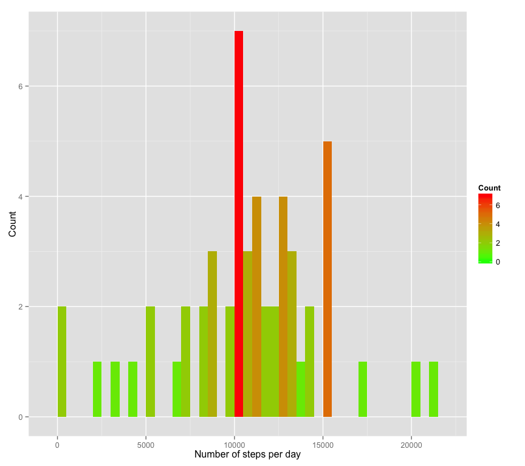
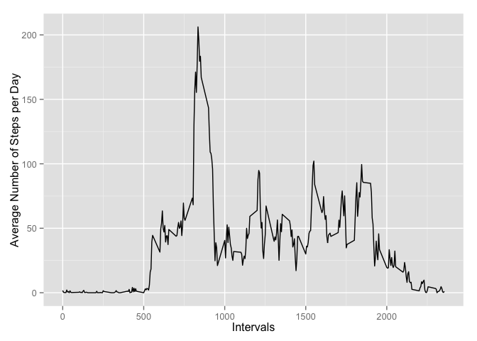
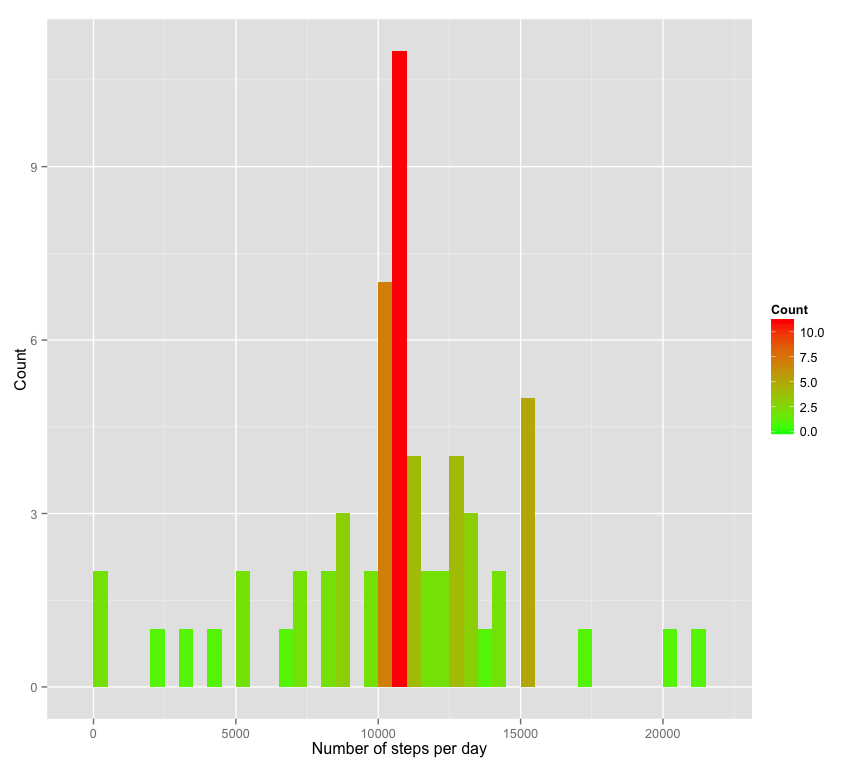
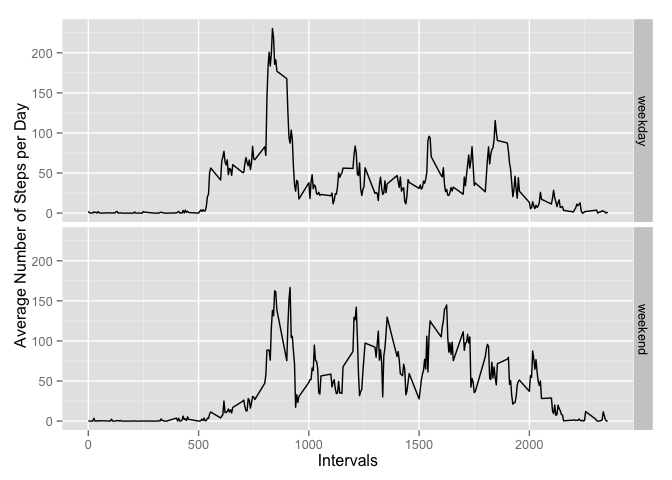

# Reproducible Research: Peer Assessment 1
Charles Chapus  
15 février 2015  

## Pre processing

First, the libraries *ggplot2* and *dplyr* are going to be used in order to perform this
analysis.


```r
library(ggplot2)
library(dplyr)
```

After, the data file will be imported into R and pre processed in convert the **date**
column into a *Date* format.


```r
data = read.csv("activity.csv")
data$date2 = as.Date(data$date , format = "%Y-%m-%d")
str(data)
```

```
## 'data.frame':	17568 obs. of  4 variables:
##  $ steps   : int  NA NA NA NA NA NA NA NA NA NA ...
##  $ date    : Factor w/ 61 levels "2012-10-01","2012-10-02",..: 1 1 1 1 1 1 1 1 1 1 ...
##  $ interval: int  0 5 10 15 20 25 30 35 40 45 ...
##  $ date2   : Date, format: "2012-10-01" "2012-10-01" ...
```

## What is mean total number of steps taken per day?

At first, we're going to ignore the missing values in the dataset. In order to do that,
a new variable is create using the **complete_cases** function. This variable is after
converted into a **dplyr** table.


```r
data2 = data[complete.cases(data),]
data2.table = tbl_df(data2)
```

### Make a histogram of the total number of steps taken each day

The *dplyr* package is used in order to easily summarise the data. The data table is summarise by computing the total number of steps for each day.


```r
sum.steps = data2.table %>% group_by(date2) %>% summarise(sum_steps = sum(steps))
head(sum.steps)
```

```
## Source: local data frame [6 x 2]
## 
##        date2 sum_steps
## 1 2012-10-02       126
## 2 2012-10-03     11352
## 3 2012-10-04     12116
## 4 2012-10-05     13294
## 5 2012-10-06     15420
## 6 2012-10-07     11015
```

A histogram of the total number of steps taken each day is created.


```r
ggplot(sum.steps , aes(sum_steps)) +
     geom_histogram(binwidth = 500 , aes(fill = ..count..)) +
     scale_fill_gradient("Count" , low = "green", high = "red") +
     labs(x = "Number of steps per day", y = "Count")
```

 

### Calculate and report the mean and median total number of steps taken per day

Taking avantage of *dplyr*, the median and the sum of total number of steps taken
per day are computed.


```r
median(sum.steps$sum_steps)
```

```
## [1] 10765
```

```r
mean(sum.steps$sum_steps)
```

```
## [1] 10766.19
```


## What is the average daily activity pattern?

### Average daily number of steps as function as the 5-minute interval

In order to see the average daily activity pattern, a new *dplyr* table is created.  
This table is ploted using *ggplot2*


```r
pattern.steps = data2.table %>% group_by(interval) %>% summarise(daily_steps = mean(steps))
ggplot(pattern.steps , aes(x = interval, y = daily_steps)) +
     geom_line() +
     labs(x = "Intervals", y = "Average Number of Steps per Day")
```

 

### Interval with the maximal number of steps in average

The 5-minute interval, on average across all the days in the dataset, which contains the maximum, is:


```r
max.steps = pattern.steps %>% filter(daily_steps == max(daily_steps))
max.steps
```

```
## Source: local data frame [1 x 2]
## 
##   interval daily_steps
## 1      835    206.1698
```

The maximum of steps is 206.1698113

## Imputing missing values

### Number of rows with NA

Again I'm going to use *dplyr* in order to answer the question: how many missing values are present?


```r
data.table = tbl_df(data)
n.missing = data.table %>% filter( is.na(steps)) %>% summarise(count = n())
```

They are 2304 missing values.

### Strategies of replacement of missing values & Creation of a new dataset
I'm going to use the mean of 5-minute interval to replace the missing values. With *dplyr*, I'm using the **mutate** function and use the **group_by** for the computation
of the mean. A new dataset **data3.table** is created with a **steps2** column where
the missing values have been filled.


```r
data3.table = data.table %>% group_by(interval) %>%
    mutate(steps2 = ifelse(is.na(steps) ,
                              mean(steps,na.rm = TRUE) ,
                              steps)
              )
head(data3.table)
```

```
## Source: local data frame [6 x 5]
## Groups: interval
## 
##   steps       date interval      date2    steps2
## 1    NA 2012-10-01        0 2012-10-01 1.7169811
## 2    NA 2012-10-01        5 2012-10-01 0.3396226
## 3    NA 2012-10-01       10 2012-10-01 0.1320755
## 4    NA 2012-10-01       15 2012-10-01 0.1509434
## 5    NA 2012-10-01       20 2012-10-01 0.0754717
## 6    NA 2012-10-01       25 2012-10-01 2.0943396
```


### Histogram of total number of steps taken each day and statistics


```r
sum2.steps = data3.table %>% group_by(date2) %>% summarise(sum_steps = sum(steps2))
head(sum2.steps)
```

```
## Source: local data frame [6 x 2]
## 
##        date2 sum_steps
## 1 2012-10-01  10766.19
## 2 2012-10-02    126.00
## 3 2012-10-03  11352.00
## 4 2012-10-04  12116.00
## 5 2012-10-05  13294.00
## 6 2012-10-06  15420.00
```

```r
ggplot(sum2.steps , aes(sum_steps)) +
     geom_histogram(binwidth = 500 , aes(fill = ..count..)) +
     scale_fill_gradient("Count" , low = "green", high = "red") +
     labs(x = "Number of steps per day", y = "Count")
```

 

If I compare the mean and the median obtained when removing the missing values to the one with the replacements, I obtained the followinf values.


```r
CompareMeanMedian = rbind( c(median(sum.steps$sum_steps), mean(sum.steps$sum_steps)) ,
                           c(median(sum2.steps$sum_steps), mean(sum2.steps$sum_steps)) )
colnames(CompareMeanMedian)<-c("Median" , "Mean")
rownames(CompareMeanMedian)<-c("Without NA","With Replacement")
CompareMeanMedian
```

```
##                    Median     Mean
## Without NA       10765.00 10766.19
## With Replacement 10766.19 10766.19
```

The median increase a little and the mean doesn't change. The explaination comes from the replacement method I chose.  
The differences in the histograms show that more days have a number of steps close to the average.  

## Are there differences in activity patterns between weekdays and weekends?

### New variable **type_day**
I'm going to create a new column **type_day** using the **mutate** function of
*dplyr* and the function **weekdays**.


```r
data3.table = data3.table %>%
    mutate(type_day = ifelse(weekdays(date2) %in% c("Saturday","Sunday"),
                             "weekend",
                             "weekday"))
head(data3.table)
```

```
## Source: local data frame [6 x 6]
## Groups: interval
## 
##   steps       date interval      date2    steps2 type_day
## 1    NA 2012-10-01        0 2012-10-01 1.7169811  weekday
## 2    NA 2012-10-01        5 2012-10-01 0.3396226  weekday
## 3    NA 2012-10-01       10 2012-10-01 0.1320755  weekday
## 4    NA 2012-10-01       15 2012-10-01 0.1509434  weekday
## 5    NA 2012-10-01       20 2012-10-01 0.0754717  weekday
## 6    NA 2012-10-01       25 2012-10-01 2.0943396  weekday
```

### Time series plot of the average number of steps per 5-minute interval


```r
pattern.steps.weekdays = data3.table %>%
                             group_by(interval,type_day) %>%
                             summarise(daily_steps = mean(steps2))
ggplot(pattern.steps.weekdays ,
       aes(x = interval, y = daily_steps)) +
     geom_line() +
     facet_grid(type_day ~ .) +
     labs(x = "Intervals", y = "Average Number of Steps per Day")
```

 
